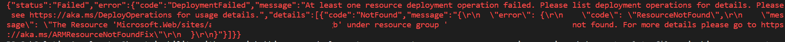
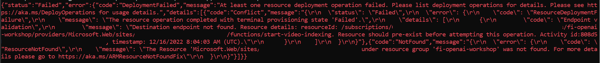
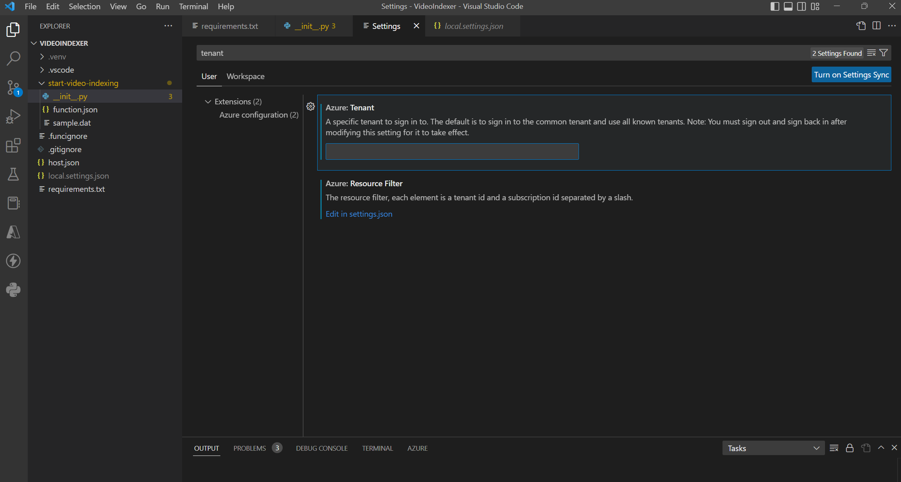
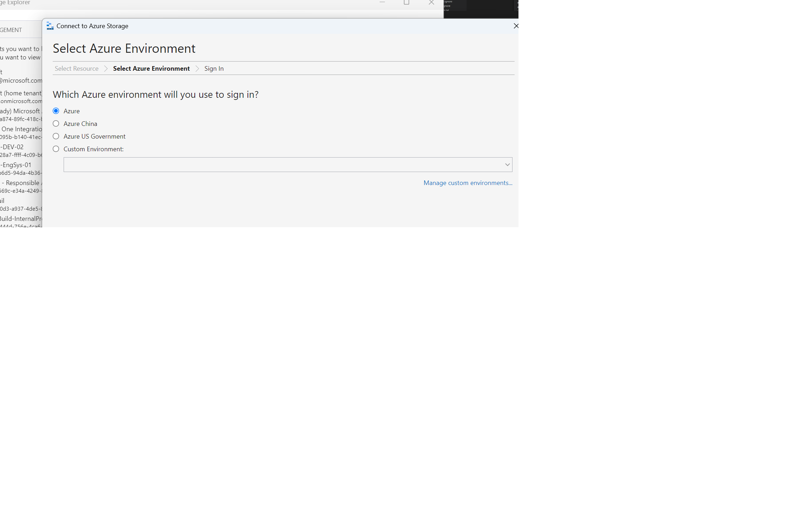
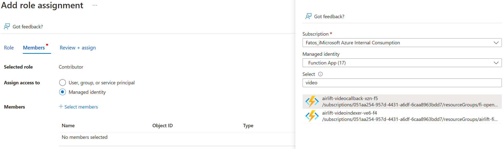
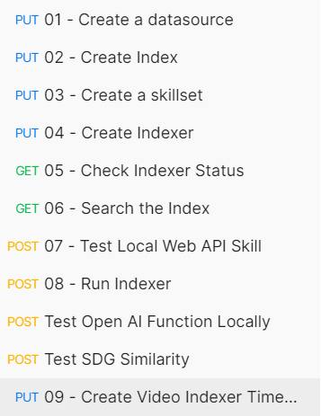

# Sunstainability demo using OpenAI

### Knowledge Mining Solution Accelerator - Code Samples | Microsoft Docs
This folder contains a Knowledge Mining Solution Accelerator solution that
leverages OpenAI model. Specific steps need to be applied and relevant 
configuration according to reader's needs. 
**CognitiveSearch.UI** < Search.UI folder is a .NET Core MVC Web app used 
a Template UI for querying a search index. 

This is an end-to-end solution containing Cognitive Services and the focus
of this README file is to prepare the reader into leveraging easily this accelerator.
 

## Technical requirements

- Azure subscriptions
- Git bash, WSL or another shell script editor on your local machine; **Git
version 2.27 or newer required**

## Prerequisites
- Setup a Python environment in your local PC(ideally https://www.anaconda.com/products/distribution)  
- Install VSCode (with Azure Functions and Python extension installed)
- [Install Visual Studio](https://visualstudio.microsoft.com/vs/community/)
- [Install Docker](https://docs.docker.com/desktop/install/windows-install/)
- [Install Azure CLI](https://learn.microsoft.com/en-us/cli/azure/install-azure-cli)  
- OpenAI access: will provide with the key and endpoint to connect to the instructor's Azure OpenAI service 
- [Install Postman](https://learning.postman.com/docs/getting-started/installation-and-updates/)

 &nbsp;

## 1. Create a resource group

In your Azure subscription, create a resource group (please make sure it's
unique using your initials or initial+last_name e.g. `fi-openai-workshop` or
`fismali-openai-workshop`).  
In the same resource group, deploy an Azure Key Vault instance.  

 <details> 
 
<summary>How to create a resource group </summary>

 <a href="https://learn.microsoft.com/en-us/azure/azure-resource-
manager/management/manage-resource-groups-cli">1.1 Create from Cloud 
Shell</a>  

 <a href="https://learn.microsoft.com/en-us/azure/azure-resource-
manager/management/manage-resource-groups-portal">1.2 Create from Portal

 <a href="https://docs.github.com/en/repositories/creating-and-managing-
repositories/cloning-a-repository">1.3 Create from Azure PowerShell</a> 
   
 </details>

 <details>
<summary>How to create a key vault </summary>

 <a href="https://learn.microsoft.com/en-us/azure/key-vault/general/quick-
create-cli">1.1 Create from Cloud Shell </a> 

 <a href="https://learn.microsoft.com/en-us/azure/key-vault/general/quick-
create-portal">1.2 Create from Portal </a>  

 <a href="https://learn.microsoft.com/en-us/azure/key-vault/general/quick-
create-powershell">1.3 Create from Azure Power Shell </a>


</details>

```
Important: Add the key vault name that you just created in kvname in the main.parameters.json file 
```

## 2 Clone the following repo: [Sustainability with Openai - Knowledge Mining](https://github.com/thinkgradient/sustainability-with-openai-km)

[How to to clone a repo](https://docs.github.com/en/repositories/creating-and-managing-repositories/cloning-a-repository)


## 3. Run the Bicep deployment

Add the resource group name you have created in Step 1.

`az deployment group create --resource-group <resource_group_name> --template-file main.bicep --parameters main.parameters.json`

After running the command above the following prompts will appear and provide with:
- OpenAI key: *will be provided*
- OpenAI type: *azure*
- endpoint: *will be provided*
- OpenAI version: *2022-06-01-preview*

After you execute the deployment command, for the first time you will get the following error which for now you can ignore. 


Re-run the Bicep deployment command again one more time.

If you hit the following error, then you have to deploy the Video Indexer function code. Please see step 3 below.

## 3. Configure VS Code for your tenant
 - Open VSCode
- Make sure VSCode is logged into correct tenant. 
  - Click on the Settings icon (bottom left) and search for 'tenant' and enter the tenant id:
  
## 4. Deploy Function Code
- Open VS Code
- Click on **File** menu
- Click on Open Folder 
- Go to your local directory where you git cloned the repo 
- Open the Azure-Functions folder and then select the `VideoIndexer` function folder. Click **Select Folder**. 
    - This will open this folder in VSCode 
- Right click on the function and click Deploy to Function App and select the Video Indexer function

 ### 4b. Now repeat the steps above for the other functions: `PDFSplitFunction`, `OpenAIFunction`, `SDGSimilarity`, `VideoIndexerCallback`, 

 

 

 
 &nbsp;

 ### 4c. Once you deploy PDFSplitFunction carry out the following steps:
  - Download Storage Explorer from https://azure.microsoft.com/en-us/products/storage/storage-explorer/
  -  
  - Deselect all subscription and select the one where you've deployed the resources and click on **Open Explorer**
  - Expand your subscription 
  - Expand Storage Accounts
  - Find the storage account that was created by the Bicep deployment command and expand it
  - Expand Blob Containers
  - Right click on **Documents** container and click on **Get Shared Access Signature..**
  - Set the **Expiry Date** to a date in the future
  - Select the following permissions: Read, Write, Create, Add
  - Click **Create**
  - Copy the **URL** link
  - Go to Azure Portal and select the relevant PDF Split function app
  - In the Function App, click on the Configuration tab under Settings and click on the **sas_url** environment variable to edit it. Paste the URL you copied earlier. Click OK and then click **Save** and **Continue**.

### 4e. Once you deploy the VideIndexer function carry out the following steps:
- Go to Azure Portal and select the relevant Video Callback function app
- From the left pane, click on Functions then "video-indexer-callback". Click on **Code + Test** and then **Get function URL**.
- Copy the URL which includes the function code too then in the Azure Portal go to the Video Indexer function app.
- From the left pane, click on the Configuration tab under Settings and click on **New application setting** 
- Enter "function_url" in the **Name** field
- Paste the Function URL you copied earlier in the **Value** field 
- Click Ok and then **Save**

### 4f. Add the following two role assignments to Video Indexer service
- From the Video Indexer service carry out the following tasks:
  - Click on **Access Control (IAM)**
  - Then click on **Add > Add role assignment**
  - Click **Contributor**
  - Click Next
  - Select **Managed Identity**
  - Click **Select members**
  - Under **Managed Identity** drop down select **Function App**
  - Find the video index and video call back functions and select both
  - Click **Select** to add them both
  - Finally click **Review + Assign**
  -  


<!---
2. Go to the Azure tab on Visual Studio Code


 &nbsp;

3. Expand the subscription in RESOURCES and right click on the Azure Function App


 &nbsp;

4. Click the Create Function App in Azure (Advanced)


 &nbsp;
-->

## 6. Run the Postman collections request

1. Import the Collections json and Environments json file into Postman

In Postman click on the following button Import in the Colleaction tab (on the left side)


Then choose the tab File and from your local folder select sustainability-with-openai-km < Postman-Collections < **Search Components.postman_collection**


Repeat the step above but for the environment variables and select sustainability-with-openai-km < Postman-Collections < **Search Env Params.postman_environment**


2. Change the environment variables to the corresponding value by looking at the service name and service keys from the resources in the relevant resource group.

Click on the Environments tab on the left and then on the tab that you have just created, *Airlift2022 Search Env Params*. You need to replace both the **INITIAL_VALUE** and **CURRENT_VALUE** with the ones that have been created on your resource group on Azure Portal.

Replace all of the following variables and keys with the ones from the Azure Portal EXCEPT:
- **prefix**
- **env_storage container**

  


## 7. Running the Collections requests one by one in this order:
Return to Postman and run the Collections requests as instructed below, one-by-one by clicking the Send button. Execute them in this order: **1 --> 2 --> 3 --> 4 --> 9**

These requests will create the required Search components, namely: 
 - 1 data source
 - 2 indexes
 - 1 skillset
 - 1 indexer




## 8. Search UI Functionality 
- Go to the git repo folder locally and then on `SearchUI < CognitiveSearc.UI` folder.
- Edit the `appsettings.json` file in the `Cognitive.Search.UI` folder with your favorite text editor.
- Change the key/value pairs the following parameters: 
  - SearchServiceName
  - SearchApiKey
  - SearchIndexName
  - SearchIndexerName
  - StorageAccountName
  - StorageAccountKey
  - StorageContainerAddress
  - AVAM_Account_Id
  - AVAM_Api_Key
  - AVAM_Account_Location
  - AVAM_Resource_Id


- For ease, you can copy the value from Environment variables in Postman and make sure those match. For the AVAM (Video Indexer bit) you get the values from Azure Portal video indexer resource.


## 9. Deploy using Docker

- Open **Docker Desktop** and make sure it's running
- Open the command prompt and navigate to the **sustainability-with-openai-km\Search-UI** directory
- Carry out the Docker commands below to build the docker image and push it to your deployed container registry.


### To run the docker commands:

Navigate to SearchUI folder and run:
1. `docker build -f Docker\Dockerfile --tag <IMAGE_NAME> .`
(Note: don't forget the dot '.' at the end of the command)

Also make sure that the <IMAGE_NAME> above is the same value as the **dockerName** parameter value from the 
**sustainability-with-openai-km\Bicep\main.parameters.json** file. Once the docker image is built carry out the following commands to push it. 

### To push the docker image from your local docker server to the Container Registry

1. `az login` --> to login to your azure account 

2. `az account set -- subscription <SUBSCRIPTION_ID>` 

3. `az acr login --name <CONTAINER_REGISTRY>`

4. `docker tag <IMAGE_NAME> <CONTAINER_REGISTRY>.azurecr.io/<IMAGE_NAME>`

5. `docker push <CONTAINER_REGISTRY>.azurecr.io/<IMAGE_NAME>`

```
Note: Wait about 15 minutes till everything has been pushed and check weblink to view the accelerator 
```
## 9. Inspect the Search UI

From the Azure Portal find the App Service and navigate to its URL or click the **Browse** button. The URL has a **.azurewebsites.net** suffix.

## 10. Process PDF files

Open Storage Explorer and upload the PDF document in the **data** folder from the git cloned repo to the **documents** container. Refresh the Storage Explorer (click on the three ellipses at the top right and click Refresh). After a few seconds you should see a **processed** folder with all the individual pages of the original PDF file split into individual PDF files.

## 10. Process Video files

Open Storage Explorer and upload the Video file in the **data** folder from the git cloned repo to the **video-knowledge-mining-drop** container. 

# Appendix 
Helpful commands
```shell
dir - to navigate between folder while in command prompt
docker container ls -a (list all containers)
docker images [OPTIONS] [REPOSITORY[:TAG]] (list docker images)
docker rm [OPTIONS] CONTAINER [CONTAINER...] (remove container)
```

&nbsp;
